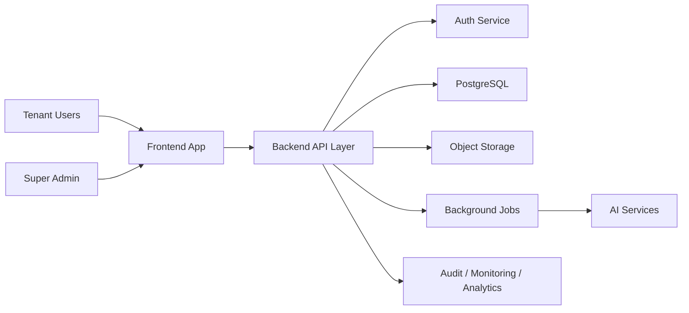

# ExamCraft Architecture Document

## 1. Purpose

This document defines the target architecture for the new `ExamCraft` SaaS platform.

It assumes a full restart. The previous codebase is a reference for workflow learnings, not the architectural baseline.

## 2. Architecture Vision

`ExamCraft` should be built as a clean, modular, multi-tenant SaaS platform for educational institutions.

The architecture must:

- support multiple institutions from a single platform
- isolate tenant data, users, branding, and settings
- centralize business logic in backend services
- support approval-driven assessment workflows
- support free-tier launch economics without blocking future scale
- remain extensible for future educational modules

## 3. Architectural Principles

### SaaS-First

The system should be designed as a product platform, not an internal deployment for one institution.

### Multi-Tenancy by Design

Tenant isolation must be built into the data model, permissions model, and service boundaries from day one.

### Backend-Controlled Workflows

Critical workflows such as paper generation, approval state transitions, export generation, and audit logging must be enforced by the backend.

### Modular Domain Boundaries

The system should be split into clear domains rather than built as a single frontend-heavy application.

### Free-Tier-First, Upgrade-Ready

The initial deployment should work on free tiers wherever practical, but the design must preserve clean upgrade paths for scale.

## 4. High-Level Architecture

## 5. Layered Architecture

### Frontend Layer

- Next.js
- TypeScript
- stable Tailwind v3 plus app-level global CSS for layout, theming, animation, and responsive UI composition
- shared design system/components in `packages/ui`
- centralized design tokens and reusable branded primitives
- institution-scoped routing and dashboards

### Backend Layer

- Node.js backend
- NestJS preferred
- Express/Fastify acceptable
- API delivery, workflow orchestration, permissions, validation, audit/event recording

### Database Layer

- PostgreSQL
- Supabase-managed PostgreSQL initially for free-tier launch
- tenant-aware persistence, normalized business entities, audit/event storage

### Storage Layer

- Supabase Storage initially
- uploads, media, exported documents, generated assets

### Jobs Layer

- export generation
- AI workflows
- duplicate detection
- notifications
- heavy batch operations

### Observability Layer

- logging
- error monitoring
- audit trails
- feature flags
- product metrics
- operational alerts

## 5.1 Frontend Design Architecture

The frontend should use a layered design architecture:

- `apps/web/app` for route shells and page composition
- `apps/web/components` for feature-level UI modules
- `packages/ui` for shared primitives such as buttons, inputs, cards, status states, avatars, and the canonical ExamCraft logo
- Tailwind theme configuration for brand colors, gradients, typography, shadows, spacing, and interaction motion
- `apps/web/app/globals.css` for product-wide surfaces, dashboard layout utilities, and branded page treatments that have not yet been absorbed into `packages/ui`

This allows the product to redesign page surfaces quickly without changing domain logic, API contracts, or Supabase integration flows.

### Current Implementation Snapshot

The architecture target remains broader than the current implementation. Today, the verified frontend surface covers:

- landing page
- login, signup, onboarding, and invite acceptance
- dashboard selection based on memberships
- institution admin team/invite workspace
- faculty question/template workspace
- academic head oversight workspace using institution summary plus content review lists
- reviewer readiness workspace using institution summary activity
- super admin platform summary workspace

Other role dashboards exist as route shells, but they should not be documented as fully implemented workflow modules yet.

## 6. Multi-Tenant Architecture

Each institution must function as an isolated tenant with its own:

- users
- permissions
- branding
- settings
- academic structure
- questions
- templates
- papers
- reports
- usage metrics

The architecture must also support platform-level global resources, especially the Global Template Library, without mixing them with tenant-owned data.

## 7. Core Domain Architecture

### Institution Domain

- institutions
- branches/campuses
- branding
- institution settings
- subscription/plan context

### Identity and Access Domain

- institution users
- roles and permissions
- invitations
- password reset
- future SSO integration

### Academic Structure Domain

- departments
- courses
- batches/classes
- academic terms
- subjects
- academic sessions

### Question Bank Domain

- question banks
- questions
- question versions
- metadata tags
- usage history
- duplicate detection references

### Template Domain

- institution templates
- template sections
- template versions
- blueprint rules

### Global Template Library Domain

- global templates
- board/university metadata
- recommendation metadata
- clone lineage
- publication status
- versioning

### Paper Domain

- papers
- paper sections
- generation runs
- export records
- paper metadata

### Approval Domain

- approval requests
- reviewer assignments
- notes
- approval history
- publish/final-lock state

### Analytics and Audit Domain

- audit logs
- usage metrics
- reporting aggregates
- operational events

### Platform Administration Domain

- feature flags
- tenant provisioning
- support tooling
- plan management
- monitoring/alerts

## 8. Data Architecture

Recommended top-level model:

- `institutions`
- `institution_users`
- `departments`
- `academic_terms`
- `subjects`
- `question_banks`
- `questions`
- `question_versions`
- `templates`
- `template_sections`
- `papers`
- `paper_sections`
- `approval_requests`
- `audit_logs`
- `subscriptions`
- `usage_metrics`

### Data Modeling Rules

- every functional record must be tenant-scoped unless explicitly global
- global platform records must be modeled separately from tenant data
- versioned entities must preserve lineage
- workflow transitions must be auditable
- naming must be standardized from day one

## 9. Global Template Library Architecture

The Global Template Library is a first-class platform capability.

### Purpose

- reduce onboarding friction
- standardize paper structures
- improve institutional trust
- shorten time to value

### Architectural Rules

- global templates are platform-managed and read-only for institutions
- institutions work with clones, not the global source
- clone lineage must be preserved
- updated versions must be visible to institution users
- recommendation logic should support onboarding and discovery

## 10. Workflow Architecture

### Institution Onboarding Flow

1. Create tenant/institution.
2. Configure branding and defaults.
3. Invite initial users.
4. Set up academic structure.
5. Recommend global templates.
6. Begin question bank and paper workflows.

### Paper Workflow

1. Select tenant context.
2. Choose global or local template.
3. Generate paper from backend service.
4. Save draft.
5. Submit for review.
6. Approve/reject/publish.
7. Export final document.

All state transitions must be enforced server-side.

### UX Architecture Constraint

Workflow pages should present a cohesive interaction language across:

- landing and marketing pages
- authentication and onboarding flows
- dashboard modules
- review and export workflows

Visual redesigns must remain contract-safe: UI changes can refine layout and interaction quality, but cannot silently alter backend behavior, auth flow semantics, or tenant context handling.

## 11. Security Architecture

The architecture must support:

- tenant-safe data access
- strong role and permission enforcement
- least-privilege administration
- secure file access
- backend-controlled workflow transitions
- comprehensive audit logging for sensitive actions

## 12. Free-Tier-First Deployment Architecture

### Initial Hosting Model

- frontend on Vercel free tier
- database/auth/storage on Supabase free tier
- CI on GitHub Actions free tier
- lightweight monitoring/error tracking on free tiers initially

### Constraint

Free-tier-first must not mean prototype-grade architecture. The system should scale by upgrading infrastructure, not by rewriting the design.

## 12.1 Brand and Design Consistency

The application must preserve a single brand reference for the ExamCraft identity, including:

- the canonical logo asset
- established ExamCraft typography
- the current dark surface plus blue-accent premium SaaS visual language used in navigation and auth surfaces
- shared design tokens that keep future modules visually consistent

New screens should consume the shared branded component layer rather than redefining page-level styles in isolation.

## 13. Final Architectural Conclusion

The new `ExamCraft` should be built as a clean, modular, free-tier-first, multi-tenant SaaS platform with strong backend ownership, reliable tenant isolation, platform-managed templates, and scalable workflow orchestration. The old project should remain only as a discovery reference.
